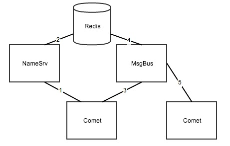

#分布式消息流系统设计

##整体结构流程图

1. 分布式消息流系统包含三个部分，这三部分各自都可以横向扩展
	* NameSrv名称注册和发现服务
	* Comet长连接服务器
	* MsgBus消息流转服务器
2. 下面是一个场景应用的例子：
	* 用户登录到Comet服务器
	* 用户的信息登记到NameSrv服务器
	* NameSrv将用户所在服务器的状态信息写入Redis
	* 用户发送消息给另外一个用户，经过MsgBus服务器
	* MsgBus服务器查找用户的信息，通过Redis
	* 然后向另外一台Comet服务器推送消息
	* 最后Comet服务器推送给用户消息
3. 集群化的说明
	* 三中服务器都是无状态服务器，唯一的有状态则依赖Redis
	* Redis即使是有状态服务器，则在可控范围内
	* 每次发送消息虽然都需要查询Redis，但可以Sharding，读写分离
	* Redis至少需要Master+Slave模式
	* NameSrv和MsgBus以及Comet，都可以LVS做load balance
4. 服务器之间通讯协议说明
	* 四个字节表示协议长度
	* 接下来两个字节用于表示协议的具体业务编号，业务层自行指定
