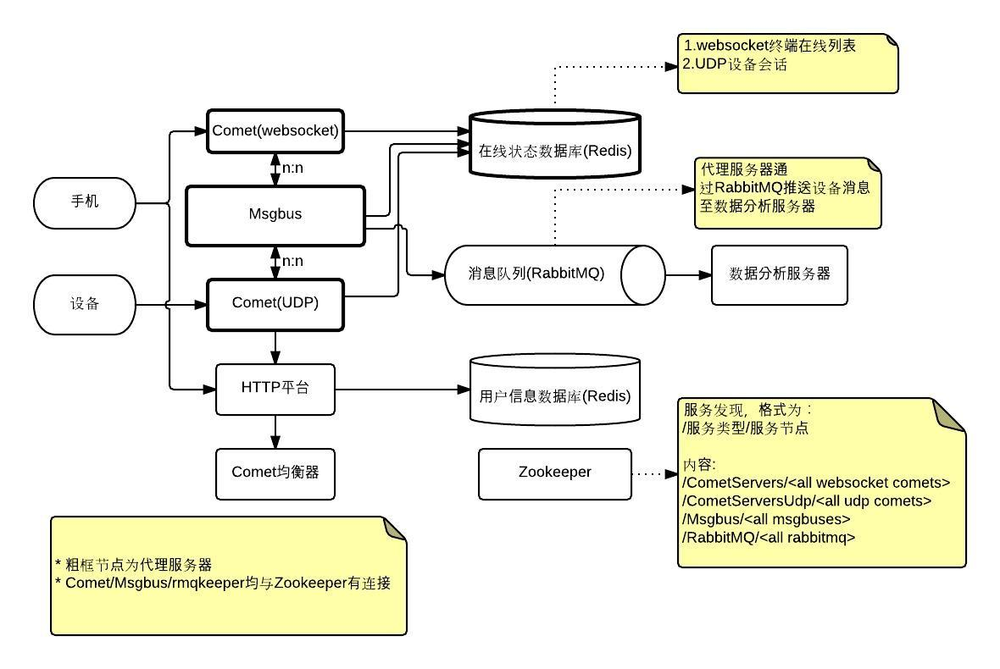
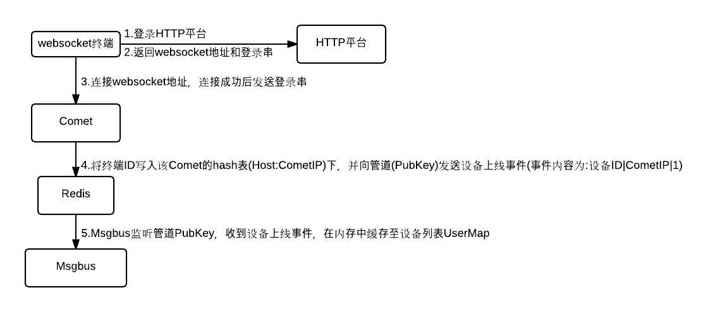
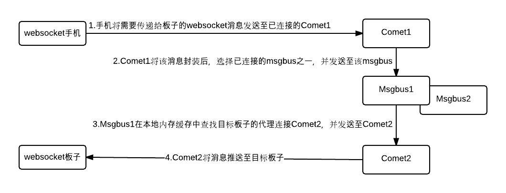
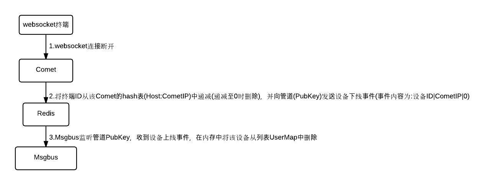
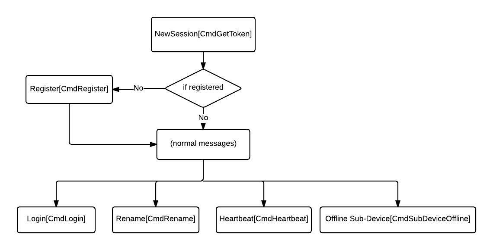
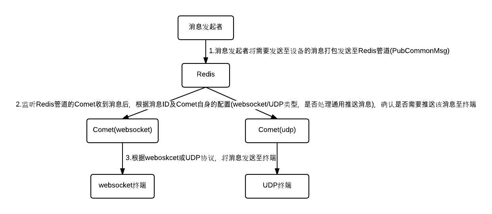
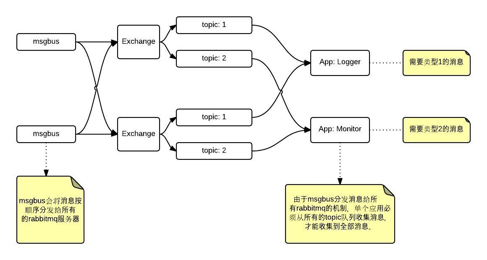

# 智能插座平台

## cloud-base

cloud-base是一个go语言的基础库，包含通用的工具代码库，工作包一部分为自己开发，另一部分是依赖的第三方库，但为了版本稳定，将用到第三方库的对应版本提交至这里，这些库在原官方库的地址及版本记录在这些目录下的git-version文件中（部分库的原版本已无法查到）。

* atomic，封装标准库的原子操作为类型；
* crypto，一些通用的加密解密函数，有些已不使用；
* goprocinfo，获取linux系统的CPU和内存信息；
* hlist，链表数据结构，由原作者从linux内核的链表数据结构重写为该go版本；
* procinfo，获取linux系统的CPU和内存信息，是对goprocinfo的部分封装；
* rmqkeeper，可执行程序，RabbitMQ的守护程序，RabbitMQ启动状态下注册至Zookeeper中的某节点下，RabbitMQ停止时从Zookeeper中删除；
* rmqs，对github.com/streadway/amqp的简单封装，只包括向RabbitMQ推送消息的调用；
* sentinels，对Redis客户端库github.com/fzzy/radix/sentinel的封装，以支持对sentinel集群的调用；
* status，提供对程序内部进行监控的库，包括添加、增加计数器、HTTP接口；
* util，一些零散的通用函数调用，包括提供CPU、内存进行性能统计的调用
* websocket，对官方golang.org/x/net/websocket的修改，支持对消息包的可选mask，并修改服务器不能正确回应websocket协议包心跳的BUG；
* youtube-go，由于github.com/youtube/vitess/go最新版本的接口已改变，不兼容，所以摘取其一个历史版本；
* zk，对github.com/samuel/go-zookeeper/zk的封装。

## 插座项目代理服务器

代理服务器适用于向手机客户端和自有智能设备（板子中的嵌入式客户端）提供Websocket或UDP连接的代理程序，该代理服务器负责提供代理连接、消息推送、UDP/HTTP协议转换、UDP终端在线管理功能。

架构图:

### 部署文档

向开发人员获得当前安装包文件cloudsocket-<ver>.tar.gz。

#### 安装Zookeeper服务器集群，得到IP地址列表ZkIPs，逗号分割的多个IP地址；

#### 安装RabbitMQ
	
可安装N个单独的RabbitMQ，并为每个RabbitMQ安装cloud-base/rmqkeeper守护程序;

安装守护程序，解压安装包至cloudsocket，并进入cloudsocket/rmqkeeper，修改rmqkeeper.conf中的以下参数:
-h RabbitMQ的服务地址
-url RabbitMQ的监控地址
-zks Zookeeper集群的IP列表ZkIPs

启动程序:
./run.sh

#### 安装Redis服务器

安装后得到IP地址RedisAddr，格式为IP:Port；

#### 安装msgbus服务器

msgbus可在单物理服务器安装多个msgbus服务进程；

解压安装包至cloudsocket，并进入cloudsocket/msgbus，修改msgbus.conf中的以下参数：
* -addr Msgbus将对Comet开放的服务地址
* -rh RedisAddr

启动程序：
./run.sh

注：配置单机多msgbus进程时，为每个进程复制得到单独的msgbus.conf文件，并将这些配置文件中的-addr修改为不同的端口，-sh修改为不同的监控端口，然后为每个进程运行命令，如：
./run.sh msgbus1.conf
./run.sh msgbus2.conf

#### 安装comet服务器

comet服务器的websocket和udp模式，都可以扩展为多机服务器，为每个物理服务器按以下步骤安装即可。

解压安装包至cloudsocket，并进入cloudsocket/comet。

##### 安装Websocket协议的Comet:

修改comet.conf中的以下参数：
* -lip 本机IP
* -ports 为提供websocket服务的TCP地址列表，用逗号分割，其中每个地址不需指定IP
* -rh RedisAddr
* -type ws
* -zks ZkIPs

启动程序:
./run.sh

##### 安装UDP协议的Comet:

修改comet.conf中的以下参数：
* -lip 本机IP
* -hhttp HostHttpAddr，格式为IP:Port，用于在内网中向平台内提供HTTP服务
* -hudp 对外提供UDP服务的UDP端口
* -hurl 为HTTP平台的根URL
* -rh RedisAddr
* -type udp
* -up true, 当部署多台UDP Comet时，应当只有唯一一台的-up参数被设置为true，否则会发生向UDP设备重复推送消息的问题）
* -uto UDP会话超时秒数
* -zks ZkIPs
* -zkroot CometServersUdp

启动程序:
./run.sh

### 开发文档

代理服务器包含2个程序主要程序和1个辅助程序：

1. comet代理连接服务器，包括websocket连接的管理和代理，UDP消息的代理，并为系统提供设备的上下线事件的触发；
2. msgbus消息总线服务器，负责转发websocket消息过程中的消息路由，并对“上传类型”的消息存储至RabbitMQ；
3. rmqkeeper消息队列服务器RabbitMQ的守护进程；

#### websocket连接登录流程

#### websocket转发消息流程

#### websocket连接退出流程

#### UDP消息处理流程

#### 代理服务器推送消息流程

需要代理服务器推送消息至用户手机或设备时，流程图如下：

#### RabbitMQ设备消息流程

### 备忘

1. 终端的ID为64位数值；
2. 手机ID为正数，设备ID为负数；

